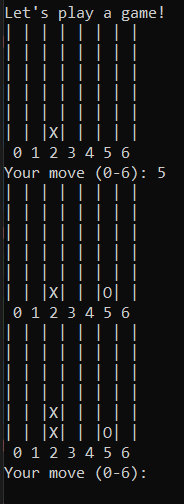

# Connect4 AI (Python)

This repository contains the Python code for training and playing a Connect4 AI. 
The AI can be trained using reinforcement learning and tested against a human player in a terminal-based environment.

---

## Overview

This project demonstrates a fully functional Connect4 AI that can:

1. Play games in the terminal against a human player
2. Be trained using simulated games
3. Be exported to ONNX format for embedded deployment (later on STM32)

While the current AI is functional, it is not highly competitive. The main goal was to create a working system that integrates gameplay, training, and deployment. Improvements can include longer training, more advanced networks, or alternative reinforcement learning strategies.

You can train a new model or play directly against the AI using the same scripts.

---

## Usage

Loading a Trained Model

To use an already trained AI model use:

from model import Agent
agent = Agent(model_name="ai_model.pth")

If model_name is left blank or None, a new untrained model will be used.

---

Playing the Game

In run_model.py or your main script (CON4_AI.py), the code is set up to first play a game against the AI:

1. The board will be displayed in the console
2. Human moves are entered by typing a column number (0–6) and pressing Enter
3. The AI will automatically respond

  

---

Training the Model

To train the model, call:

from run_model import run_model
run_model(agent, game, num_episodes=1000)

This will simulate games and train the neural network using stored experiences.

---

Saving the Model for Deployment

After training, the model can be exported in ONNX format for embedded deployment:

agent.save_model_C()

This will create a file ai_model.onnx that can be used on your STM32 development board or other platforms that support ONNX.

---

License

This project is free and open source. You can use, modify, and expand it freely.

